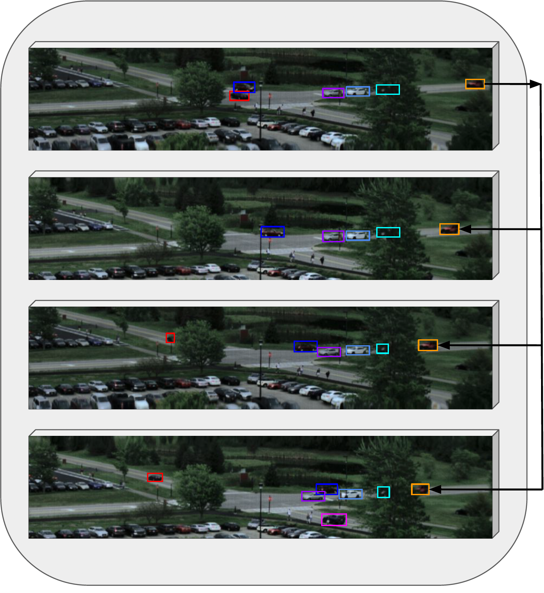

# RooftopHSI

The information for this project can be found here: 
- MMDetection source code [here](https://drive.google.com/drive/folders/1pRUYocJYlbqsRdGBfVmN_wvKOm0dOcmE?usp=sharing)
- Training dataset (with masks for 10% semi-supervised learning and 100% full-supervised learning) [here](https://drive.google.com/drive/folders/1MmLmo4LYWqt3Wc5ZohrpaQjKlVorl6Wy?usp=sharing)
- Validation dataset [here](https://drive.google.com/drive/folders/1aVHaqZE6SHdYE37wD3fApy3OcPIBi0sz?usp=sharing)
- Test dataset [here](https://drive.google.com/drive/folders/1yqnIP5ExryNEX3U2wTBEC0O-g-Xp9bdf?usp=sharing)

## Reading the dataset

Each image comes in two parts - spectral calibrated radiance image and its corresponding mask. The annotations are present in a different json file, readable via the MMDetection framework. We refer the readers to the loading_rshi script within mmdet-datasets-pipelines for a beginner script to load the data from the npy files, that have been optimized to contain useful information while saving a lot of space with respect to standard hyperspectral image occupancy.

## About the dataset
Our goal is to understand challenges in hyperspectral imagery from both a ground and aerial perspective. To perform such an analysis, we need systems that provide relatively rich spatial and spectral information. For our research, we choose the Headwall Micro HE (High Efficiency) Hyperspec E-series camera system that has a higher spatial and spectral resolution than typical snapshot cameras.

The Hyperspec camera is a hyperspectral push-broom scanner that records data at a resolution of 1600 pixels cross-track horizontally, 120 to 400 pixels vertically, and 371 spectral bands (390 nm to 1000 nm), at a modest frame rate of 0.8 - 1.2 FPS. Push-broom scanners work by collecting one spatial line at a time along with the associated spectra at each pixel. The camera is moved over the imaging area (along-track) to create the second spatial dimension and the lines are stitched together to create the hyperspectral cube. In this application, we obtain along-track (motion) pixels by nodding the pan-tilt unit. The number of along-track pixels and frame rate are inversely related for line scanning cameras, meaning that the frame rate decreases as along-track pixels per frame increases. The number of along-track pixels in our dataset varies as needed such that our target scene region is fully captured in each frame. We use a frame period and exposure of 5 milliseconds, and hence the typical image resolution is between 150-190 pixels vertically, 1600 pixels horizontally and 371 bands in the spectral (channel) dimension.

We gathered data over three days (08-29, 09-09, and 09-10) and an average duration of 1.5 hours each morning. We mounted the camera at a fixed location on the rooftop overlooking the same intersection spot, at the same relative altitude. We observed changes in the atmosphere (i.e., the weather changed from clear skies to clouds and back, and we continued to collect data irrespective of this hindrance). This resulted in images that varied in signal magnitude due to the presence of clouds, variation in illumination, and other environmental interference. This can be reduced (or normalized) by first converting the data from digital counts to radiance then a final conversion to reflectance units through use of calibration panels. However, real-time conversion of hyperspectral cubes from radiance to reflectance is not possible at all times - there may be scenes where deploying a calibration panel is not practical (for example, deploying the camera on a moving unmanned aerial vehicle or plane). Hence, we did not deploy calibration panels in the scene to convert to reflectance. From a real-time usability perspective, we consider the lack of reflectance data as adversary for radiometric remote-sensing.

The total number of images in each set are as follows: Training: 989, Validation: 605, and Test: 1296
